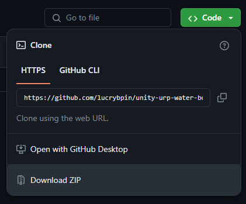
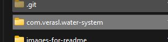
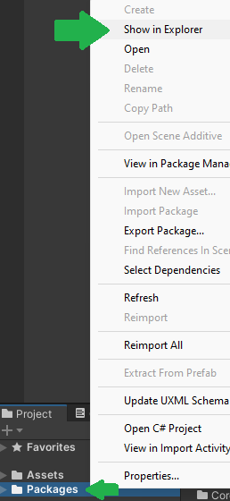
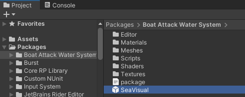
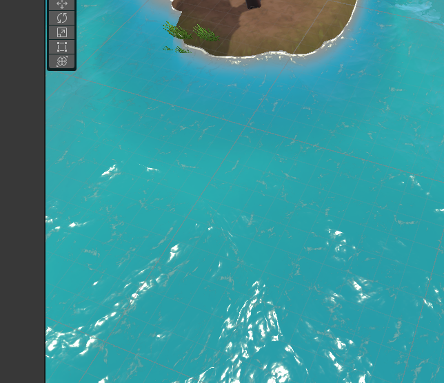

### How to Use it

1 - Clone this folder to your computer or simply download the zip  
  

2 - Copy the com.verasl.water-system  
  

3 - In your URP project open the Packages folder  
  

4 - Now in your project, inside the packages folder you can drag and drop the SeaVisual prefab inside the Boat Attack Water System folder  
  

5 - Expected result  
  
